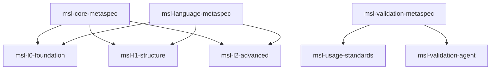

# Metaspec Patterns in MSL

## The Self-Referential Nature of MSL

MSL demonstrates its maturity and power through self-reference - it uses its own features to govern itself. The core MSL specifications are written in MSL and governed by metaspecs that are themselves written in MSL.

This creates a fascinating bootstrap pattern:
```
MSL defines → Metaspecs define → Governance rules govern → MSL itself
```

## Understanding Metaspecs vs Other MSL Features

### The Three Relationships

MSL now supports three distinct relationship types:

| Relationship | Keyword | Meaning | Use Case |
|-------------|---------|---------|----------|
| **Inheritance** | `extends` | IS-A relationship | "Admin auth IS-A user auth with more features" |
| **Governance** | `governed-by` | CONFORMS-TO relationship | "API spec CONFORMS-TO REST standards" |
| **Template** | `type: template` | DEFINES pattern | "This DEFINES a reusable pattern" |

### When to Use Each

#### Use `extends` (Inheritance) When:
- Creating a specialized version of something
- Adding features to an existing specification
- Following an IS-A relationship
- Example: `premium-user extends user`

#### Use `governed-by` (Governance) When:
- Ensuring compliance with standards
- Following architectural patterns
- Meeting quality requirements
- Example: `payment-api governed-by pci-compliance-metaspec`

#### Use `type: template` When:
- Creating reusable patterns
- Defining specification families
- Providing variable substitution
- Example: `microservice-template` with `${service_name}` variable

## The Meta-Meta Pattern

MSL's self-referential structure creates interesting levels:

### Level 0: Regular Specifications
```yaml
---
id: user-api
---
```
Regular specifications that describe systems, APIs, features, etc.

### Level 1: Metaspecs
```yaml
---
id: api-metaspec
type: metaspec
---
```
Specifications that govern other specifications.

### Level 2: Meta-Metaspecs
```yaml
---
id: msl-core-metaspec
type: metaspec
governed-by: msl-core-metaspec  # Self-governance!
---
```
Metaspecs that govern metaspecs, including themselves.

## Core MSL Metaspec Architecture

The MSL project includes several foundational metaspecs:



## Practical Examples

### Example 1: Creating a Domain Metaspec

```markdown
---
id: healthcare-api-metaspec
type: metaspec
governed-by: msl-validation-metaspec
---

# Healthcare API Metaspec

## Structural Requirements
- MUST include HIPAA compliance section
- MUST specify PHI handling procedures
- MUST document audit trail requirements

## Compliance Requirements
- MUST meet HIPAA technical safeguards
- MUST implement encryption standards
- MUST provide access control specifications
```

### Example 2: Multi-Level Governance

```markdown
---
id: patient-records-api
extends: rest-api-base
governed-by: [healthcare-api-metaspec, rest-api-metaspec, gdpr-metaspec]
---

# Patient Records API

[Inherits from rest-api-base AND conforms to multiple metaspecs]
```

### Example 3: Self-Governing Metaspec

```markdown
---
id: metaspec-metaspec
type: metaspec
governed-by: metaspec-metaspec  # Governs itself!
---

# Metaspec for Metaspecs

## Requirements for All Metaspecs
- MUST define structural requirements
- MUST provide validation criteria
- MUST include practical examples
```

## Benefits of Metaspec Patterns

### 1. Architectural Consistency
Metaspecs ensure all specifications in a family follow consistent patterns:
- Same section structure
- Consistent terminology
- Uniform quality standards

### 2. Automated Validation
Tools can automatically validate specifications against their metaspecs:
```bash
$ msl-validate user-api.md
Checking governance: rest-api-metaspec
✓ Has required endpoints section
✓ Has required authentication section
✗ Missing required rate limiting section
Score: 85/100
```

### 3. Organizational Standards
Organizations can create metaspecs for their specific needs:
- Company coding standards
- Industry compliance requirements
- Domain-specific patterns

### 4. Quality Assurance
Metaspecs define measurable quality metrics:
- Completeness scores
- Compliance percentages
- Consistency ratings

## Implementation Guidelines

### Creating Your First Metaspec

1. **Identify the Pattern**: What specifications will this govern?
2. **Define Structure**: What sections are required?
3. **Specify Validation**: What makes a specification compliant?
4. **Provide Examples**: Show good and bad examples
5. **Test with Real Specs**: Validate existing specifications

### Metaspec Checklist

- [ ] Clear scope definition
- [ ] Structural requirements (sections, format)
- [ ] Content requirements (what must be specified)
- [ ] Quality metrics (how to measure compliance)
- [ ] Validation rules (pass/fail criteria)
- [ ] Examples (compliant and non-compliant)
- [ ] Relationship to other metaspecs

## Advanced Patterns

### Conditional Governance

```yaml
---
id: payment-service
governed-by: |
  if region == "EU":
    [gdpr-metaspec, psd2-metaspec]
  elif region == "US":
    [ccpa-metaspec, pci-metaspec]
  else:
    [standard-api-metaspec]
---
```

### Version-Specific Governance

```yaml
---
id: legacy-api
governed-by: rest-api-metaspec@v1.0  # Older metaspec version
---
```

### Composition Over Inheritance

```yaml
---
id: hybrid-service
# Inherits implementation
extends: base-service
# Conforms to multiple patterns
governed-by: [microservice-metaspec, event-driven-metaspec]
---
```

## Future Possibilities

### Dynamic Metaspec Selection
Specifications could dynamically select their governing metaspec based on context:
- Development vs production
- Internal vs external APIs
- Different regulatory environments

### Metaspec Inheritance
Metaspecs could extend other metaspecs:
```yaml
---
id: strict-api-metaspec
extends: api-metaspec
# Adds additional requirements
---
```

### AI-Driven Metaspec Generation
AI could analyze existing specifications and suggest appropriate metaspecs:
- Pattern detection
- Compliance inference
- Quality standard extraction

## Conclusion

Metaspec patterns in MSL provide a powerful way to ensure consistency, quality, and compliance across specification families. The self-referential nature of MSL's own metaspecs demonstrates the language's maturity and capability.

Key takeaways:
1. **Metaspecs govern structure and quality**, not behavior
2. **Use `governed-by` for compliance**, not inheritance
3. **MSL uses its own features** to govern itself
4. **Multiple governance** is supported and encouraged
5. **Validation becomes automated** with proper metaspecs

The meta-meta pattern (MSL → Metaspecs → Governance → MSL) creates a self-validating, self-improving system that ensures MSL specifications maintain high quality while remaining practical and usable.

---
*Specification format: [MSL Level 2](https://github.com/chrs-myrs/msl-specification)*