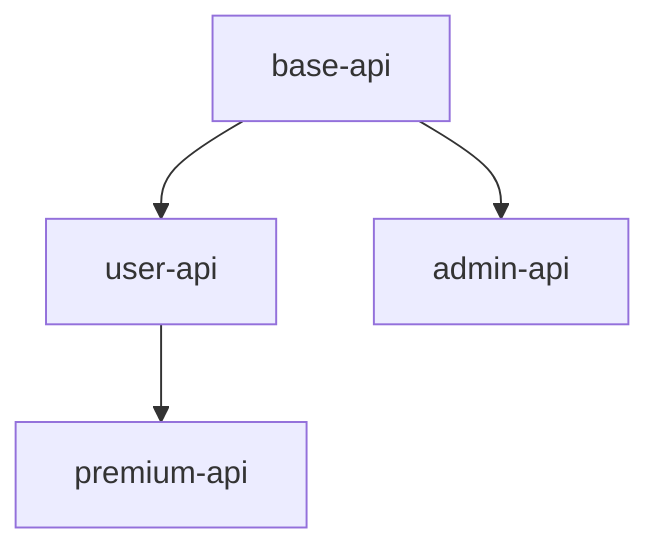

# MSL Tools & Integration

**Complete guide to MSL tools, validation systems, CI/CD integration, and editor support. Learn how to automate MSL workflows and integrate with development pipelines.**

## Table of Contents

1. [MSL CLI Tools](#msl-cli-tools)
   - [msl-validate](#msl-validate)
   - [msl-lint](#msl-lint)
   - [msl-render](#msl-render)
   - [msl-batch-validate](#msl-batch-validate)
2. [Installation](#installation)
3. [Configuration](#configuration)
4. [CI/CD Integration](#cicd-integration)
5. [Editor Support](#editor-support)
6. [Claude Code Agents](#claude-code-agents)
7. [API Reference](#api-reference)
8. [Performance Guide](#performance-guide)
9. [Troubleshooting](#troubleshooting)

## MSL CLI Tools

### msl-validate

**Purpose:** Comprehensive validation of MSL specifications with quality metrics.

#### Installation
```bash
# npm (global)
npm install -g msl-validate

# npm (project)
npm install --save-dev msl-validate

# yarn
yarn add -D msl-validate
```

#### Basic Usage
```bash
# Validate single file
msl-validate spec.md

# Validate directory
msl-validate ./specs/

# Recursive validation
msl-validate ./specs/ --recursive
```

#### Options and Flags
```bash
msl-validate [files...] [options]

Options:
  -r, --recursive         Validate directories recursively
  -m, --min-score <n>     Minimum quality score (default: 80)
  -f, --format <type>     Output format: text|json|xml|markdown (default: text)
  -o, --output <file>     Write results to file
  -q, --quiet            Suppress non-error output
  -v, --verbose          Show detailed validation information
  --fix                  Automatically fix common issues
  --rules <rules>        Comma-separated validation rules
  --config <file>        Configuration file path
  --no-color            Disable colored output
  --strict              Fail on warnings
  -h, --help            Show help
  -V, --version         Show version
```

#### Exit Codes
- `0` - Validation successful, all specs pass
- `1` - Validation failed, errors found
- `2` - Configuration or input error
- `3` - Internal tool error

#### Example Workflows

**Basic Validation:**
```bash
# Validate and show results
msl-validate user-auth.md

# Output:
✓ user-auth.md
  Quality Score: 85/100
  DRY Compliance: 90/100
  Testability: 82/100
  No critical issues found
```

**Quality Enforcement:**
```bash
# Require minimum score of 90
msl-validate spec.md --min-score 90

# Check specific rules only
msl-validate spec.md --rules dry,testability

# Strict mode (fail on warnings)
msl-validate spec.md --strict
```

**Batch Validation:**
```bash
# Validate all specs with JSON output
msl-validate ./specs/ -r -f json -o results.json

# Fix common issues automatically
msl-validate ./specs/ -r --fix
```

**CI Integration:**
```bash
# Silent mode for CI
msl-validate ./specs/ -r -q || exit 1

# Generate markdown report
msl-validate ./specs/ -r -f markdown -o validation-report.md
```

---

### msl-lint

**Purpose:** Fast syntax checking and style enforcement for MSL files.

#### Basic Usage
```bash
# Lint single file
msl-lint spec.md

# Lint with auto-fix
msl-lint spec.md --fix

# Lint directory
msl-lint ./specs/ -r
```

#### Options
```bash
msl-lint [files...] [options]

Options:
  -r, --recursive        Lint directories recursively
  -f, --fix             Auto-fix issues when possible
  -c, --config <file>   Use configuration file
  --format <type>       Output format: stylish|json|compact
  --quiet              Report errors only
  --max-warnings <n>   Number of warnings to trigger failure
```

#### Lint Rules

**Syntax Rules:**
- `require-requirements` - Must have Requirements section
- `valid-frontmatter` - Valid YAML in frontmatter
- `unique-req-ids` - No duplicate requirement IDs
- `valid-req-format` - Correct requirement syntax

**Style Rules:**
- `consistent-markers` - Use consistent marker style
- `kebab-case-files` - File names in kebab-case
- `ordered-req-ids` - Sequential requirement IDs
- `no-empty-sections` - No empty sections

#### Example Output
```bash
$ msl-lint user-auth.md

user-auth.md
  line 3:1  warning  File should use kebab-case  kebab-case-files
  line 15:1  error   Duplicate requirement ID     unique-req-ids
  line 22:1  warning Missing priority marker      require-priority

✖ 3 problems (1 error, 2 warnings)
  1 error and 0 warnings potentially fixable with --fix
```

---

### msl-render

**Purpose:** Convert MSL specifications to various output formats.

#### Basic Usage
```bash
# Render to HTML
msl-render spec.md -o spec.html

# Render to PDF
msl-render spec.md -f pdf -o spec.pdf

# Generate documentation site
msl-render ./specs/ -f site -o ./docs/
```

#### Options
```bash
msl-render [input] [options]

Options:
  -f, --format <type>   Output format: html|pdf|docx|site|json
  -o, --output <path>   Output file or directory
  -t, --template <file> Custom template file
  --theme <name>       Built-in theme: default|dark|minimal
  --toc               Include table of contents
  --standalone        Generate standalone document
  --css <file>        Custom CSS file
  --metadata <json>   Additional metadata
```

#### Supported Formats

| Format | Extension | Description |
|--------|-----------|-------------|
| HTML | .html | Web page with styling |
| PDF | .pdf | Printable document |
| DOCX | .docx | Microsoft Word |
| Site | (dir) | Static website |
| JSON | .json | Structured data |
| Markdown | .md | Processed markdown |

#### Template Examples

**Custom HTML Template:**
```html
<!-- template.html -->
<!DOCTYPE html>
<html>
<head>
  <title>{{title}}</title>
  <style>{{styles}}</style>
</head>
<body>
  <header>{{header}}</header>
  <main>{{content}}</main>
  <footer>{{footer}}</footer>
</body>
</html>
```

**Usage:**
```bash
msl-render spec.md -t template.html -o output.html
```

---

### msl-batch-validate

**Purpose:** Validate multiple MSL specifications with dependency analysis and aggregate reporting.

#### Basic Usage
```bash
# Validate all specs in directory
msl-batch-validate ./specs/

# Generate comprehensive report
msl-batch-validate ./specs/ -o report.md

# Check inheritance chains
msl-batch-validate ./specs/ --check-inheritance
```

#### Options
```bash
msl-batch-validate [directory] [options]

Options:
  -o, --output <file>      Output report file
  -f, --format <type>      Report format: text|markdown|json|html
  --check-inheritance      Validate inheritance relationships
  --check-references       Validate cross-references
  --max-parallel <n>       Maximum parallel validations
  --fail-fast             Stop on first error
  --summary-only          Show summary without details
  --metrics               Include quality metrics
  --recommendations       Generate improvement recommendations
```

#### Batch Report Example
```markdown
# MSL Batch Validation Report

**Date:** 2024-01-15
**Directory:** ./specs/
**Files Analyzed:** 47

## Summary
- ✅ Valid Specifications: 43/47 (91.5%)
- ⚠️ Warnings: 12
- ❌ Errors: 4

## Quality Metrics
| Metric | Average | Min | Max |
|--------|---------|-----|-----|
| Overall Score | 82.3 | 68 | 95 |
| DRY Compliance | 86.1 | 72 | 98 |
| Testability | 78.9 | 65 | 92 |

## Inheritance Analysis


## Issues by Severity
### Critical (4)
1. `payment-api.md:15` - Circular inheritance detected
2. `auth-spec.md:23` - Missing Requirements section

### Warnings (12)
1. `user-profile.md` - Low testability score (65%)
2. `data-schema.md` - DRY violations detected
```

---

## Installation

### System Requirements
- Node.js 14.0.0 or higher
- npm 6.0.0 or yarn 1.22.0
- Git (for version control integration)

### Global Installation
```bash
# Install all MSL tools globally
npm install -g msl-tools

# Or install individually
npm install -g msl-validate msl-lint msl-render msl-batch-validate

# Verify installation
msl-validate --version
```

### Project Installation
```bash
# Add to project
npm install --save-dev msl-tools

# Add npm scripts
{
  "scripts": {
    "validate": "msl-validate ./specs/ -r",
    "lint": "msl-lint ./specs/ -r",
    "validate:ci": "msl-validate ./specs/ -r -q --min-score 85"
  }
}
```

### Docker Installation
```dockerfile
FROM node:16-alpine
RUN npm install -g msl-tools
WORKDIR /specs
CMD ["msl-validate", "."]
```

---

## Configuration

### Configuration Files

MSL tools look for configuration in this order:
1. Command line arguments
2. `.msl-validate.yml` in current directory
3. `.msl-validate.yml` in project root
4. `msl.config.js` in project root
5. Package.json `msl` field

### .msl-validate.yml

```yaml
# .msl-validate.yml
version: 1
rules:
  # Validation rules
  dry-compliance:
    enabled: true
    threshold: 85
  testability:
    enabled: true
    min-score: 90
  inheritance-depth:
    enabled: true
    max-depth: 3
  
# File patterns
include:
  - "specs/**/*.md"
  - "requirements/**/*.md"
exclude:
  - "**/*.draft.md"
  - "**/archive/**"

# Quality thresholds
quality:
  min-overall-score: 80
  min-dry-score: 85
  min-testability: 90
  min-cohesion: 80

# Output settings
output:
  format: text
  colors: true
  verbose: false
  
# Validation behavior
validation:
  fail-on-warning: false
  fix-automatically: false
  check-references: true
  check-inheritance: true
```

### msl.config.js

```javascript
// msl.config.js
module.exports = {
  // Tool-specific settings
  validate: {
    rules: {
      'dry-compliance': ['error', { threshold: 85 }],
      'testability': ['warn', { minScore: 90 }],
      'unique-req-ids': 'error'
    }
  },
  
  lint: {
    extends: 'recommended',
    rules: {
      'kebab-case-files': 'warn',
      'ordered-req-ids': 'off'
    }
  },
  
  render: {
    theme: 'default',
    includeToC: true,
    highlightSyntax: true
  },
  
  // Global settings
  paths: {
    specs: './specs',
    output: './dist'
  }
};
```

### Package.json Configuration

```json
{
  "msl": {
    "validate": {
      "minScore": 85,
      "rules": ["dry", "testability"]
    },
    "lint": {
      "fix": true
    }
  }
}
```

---

## CI/CD Integration

### GitHub Actions

```yaml
# .github/workflows/msl-validation.yml
name: MSL Validation

on:
  push:
    paths:
      - 'specs/**/*.md'
      - 'requirements/**/*.md'
  pull_request:
    paths:
      - 'specs/**/*.md'

jobs:
  validate:
    runs-on: ubuntu-latest
    steps:
      - uses: actions/checkout@v3
      
      - name: Setup Node.js
        uses: actions/setup-node@v3
        with:
          node-version: '16'
          
      - name: Install MSL tools
        run: npm install -g msl-tools
        
      - name: Lint specifications
        run: msl-lint ./specs/ -r
        
      - name: Validate specifications
        run: msl-validate ./specs/ -r --min-score 85
        
      - name: Generate validation report
        if: always()
        run: |
          msl-batch-validate ./specs/ \
            -f markdown \
            -o validation-report.md \
            --metrics \
            --recommendations
            
      - name: Upload report
        if: always()
        uses: actions/upload-artifact@v3
        with:
          name: validation-report
          path: validation-report.md
          
      - name: Comment PR
        if: github.event_name == 'pull_request'
        uses: actions/github-script@v6
        with:
          script: |
            const fs = require('fs');
            const report = fs.readFileSync('validation-report.md', 'utf8');
            github.rest.issues.createComment({
              issue_number: context.issue.number,
              owner: context.repo.owner,
              repo: context.repo.repo,
              body: report
            });
```

### GitLab CI

```yaml
# .gitlab-ci.yml
stages:
  - validate
  - report

variables:
  MSL_MIN_SCORE: "85"

validate:specs:
  stage: validate
  image: node:16
  before_script:
    - npm install -g msl-tools
  script:
    - msl-lint ./specs/ -r
    - msl-validate ./specs/ -r --min-score $MSL_MIN_SCORE
  artifacts:
    when: always
    paths:
      - validation-report.md
    reports:
      junit: validation-report.xml

generate:report:
  stage: report
  image: node:16
  before_script:
    - npm install -g msl-tools
  script:
    - msl-batch-validate ./specs/ -f markdown -o report.md
  artifacts:
    paths:
      - report.md
    expire_in: 30 days
```

### Jenkins Pipeline

```groovy
// Jenkinsfile
pipeline {
    agent any
    
    environment {
        MSL_MIN_SCORE = '85'
    }
    
    stages {
        stage('Setup') {
            steps {
                sh 'npm install -g msl-tools'
            }
        }
        
        stage('Lint') {
            steps {
                sh 'msl-lint ./specs/ -r'
            }
        }
        
        stage('Validate') {
            steps {
                sh 'msl-validate ./specs/ -r --min-score ${MSL_MIN_SCORE}'
            }
        }
        
        stage('Report') {
            steps {
                sh 'msl-batch-validate ./specs/ -f json -o report.json'
                publishHTML([
                    reportDir: '.',
                    reportFiles: 'report.html',
                    reportName: 'MSL Validation Report'
                ])
            }
        }
    }
    
    post {
        always {
            archiveArtifacts artifacts: 'report.*', fingerprint: true
        }
    }
}
```

### Pre-commit Hook

```yaml
# .pre-commit-config.yaml
repos:
  - repo: local
    hooks:
      - id: msl-lint
        name: MSL Lint
        entry: msl-lint
        language: system
        files: \.(md|msl)$
        pass_filenames: true
        
      - id: msl-validate
        name: MSL Validate
        entry: msl-validate --min-score 80
        language: system
        files: ^specs/.*\.md$
        pass_filenames: true
```

---

## Editor Support

### VS Code

**Extension:** MSL Language Support

```json
// .vscode/settings.json
{
  "msl.validate.enable": true,
  "msl.validate.minScore": 85,
  "msl.validate.onSave": true,
  "msl.lint.enable": true,
  "msl.lint.rules": {
    "unique-req-ids": "error",
    "testability": "warning"
  },
  "msl.format.enable": true,
  "files.associations": {
    "*.msl": "markdown"
  }
}
```

**Features:**
- Syntax highlighting
- Real-time validation
- IntelliSense for markers
- Go to definition for inheritance
- Hover information for requirements
- Quick fixes for common issues

### Vim/Neovim

```vim
" ~/.vimrc or init.vim
" MSL syntax highlighting
au BufRead,BufNewFile *.msl set filetype=markdown

" MSL validation on save
autocmd BufWritePost *.md,*.msl silent! !msl-validate %

" MSL lint integration
let g:ale_linters = {
\   'markdown': ['msl-lint'],
\}

" Custom commands
command! MSLValidate :!msl-validate %
command! MSLLint :!msl-lint % --fix
command! MSLRender :!msl-render % -o %.html
```

### Sublime Text

```json
// MSL.sublime-settings
{
  "extensions": ["msl", "md"],
  "msl_validate_on_save": true,
  "msl_min_score": 85,
  "msl_lint_enabled": true,
  "msl_show_errors_inline": true
}
```

### IntelliJ IDEA

```xml
<!-- .idea/msl.xml -->
<component name="MSLSettings">
  <option name="validateOnSave" value="true" />
  <option name="minQualityScore" value="85" />
  <option name="lintEnabled" value="true" />
  <option name="autoFixOnSave" value="false" />
</component>
```

---

## Claude Code Agents

### MSL Validation Agent

**Purpose:** AI-powered specification quality analysis and improvement recommendations.

#### Invocation Examples

**Example 1: Basic Validation**
```markdown
@claude-code validate my specification

Request:
"Please validate the user-auth.md specification for architectural quality"

Response:
"I'll analyze your specification for quality issues...

Quality Score: 78/100
- DRY Compliance: 85/100 ✓
- Testability: 72/100 ⚠️
- Cohesion: 88/100 ✓

Issues Found:
1. REQ-002 lacks measurable criteria
2. REQ-005 duplicates REQ-003 content
3. Missing error handling requirements

Recommendations:
1. Add timeout values to REQ-002
2. Extract common authentication logic
3. Add requirements for failure scenarios"
```

**Example 2: Batch Validation**
```markdown
@claude-code validate all specs

Request:
"Run batch validation on the specs/ directory and identify patterns"

Response:
"Analyzing 24 specifications...

Summary:
- Average Quality: 82.4/100
- Common Issues: 
  - 62% lack measurable criteria
  - 38% have DRY violations
  - 25% have deep inheritance

Top Recommendations:
1. Create api-base template for common patterns
2. Add testability criteria to vague requirements
3. Flatten inheritance in payment-* specs"
```

**Example 3: Fix Suggestions**
```markdown
@claude-code suggest fixes

Request:
"How can I improve the testability of my requirements?"

Response:
"Here are specific improvements for testability:

Before: 'System should be fast'
After: 'API responds within 200ms for 95th percentile'

Before: 'Good error handling'
After: 'Returns 400 with specific error message for invalid input'

Before: 'Secure authentication'
After: 'Requires valid JWT token with exp claim < 1 hour'"
```

#### Agent Capabilities

**Features (10+):**
1. Quality score calculation (0-100)
2. DRY principle validation
3. Inheritance analysis
4. Testability assessment
5. Cohesion/coupling metrics
6. Fix recommendations
7. Template extraction
8. Pattern detection
9. Cross-reference validation
10. Batch processing
11. Report generation
12. Trend analysis

**Limitations (5+):**
1. Cannot modify files directly
2. Limited to <500KB context
3. No real-time monitoring
4. Cannot execute validation tools
5. English language only
6. No version control integration

### MSL Batch Validator Agent

**Purpose:** Process multiple specifications with aggregate analysis.

#### Request/Response Format

**Request Structure:**
```json
{
  "action": "batch_validate",
  "directory": "./specs/",
  "options": {
    "checkInheritance": true,
    "generateReport": true,
    "includeRecommendations": true
  }
}
```

**Response Structure:**
```json
{
  "summary": {
    "totalFiles": 47,
    "validFiles": 43,
    "errors": 4,
    "warnings": 12,
    "averageScore": 82.3
  },
  "issues": [
    {
      "file": "payment-api.md",
      "line": 15,
      "severity": "error",
      "message": "Circular inheritance detected",
      "fix": "Remove circular reference in extends"
    }
  ],
  "metrics": {
    "dry": 86.1,
    "testability": 78.9,
    "cohesion": 84.2
  },
  "recommendations": [
    "Extract common API patterns to base template",
    "Improve testability in 15 specifications",
    "Fix 3 inheritance depth violations"
  ]
}
```

### MCP Server Integration (context7)

**Purpose:** Efficient context management for AI assistance.

#### Configuration

```json
// .context7/config.json
{
  "msl": {
    "maxContextSize": 100000,
    "recommendedSize": 50000,
    "includePatterns": [
      "specs/**/*.md",
      "requirements/**/*.md"
    ],
    "excludePatterns": [
      "**/archive/**",
      "**/*.draft.md"
    ],
    "validation": {
      "enabled": true,
      "minScore": 80
    }
  }
}
```

#### Usage Examples

**Example 1: Context Loading**
```typescript
// Load MSL context
const context = await mcp.loadContext('msl', {
  directory: './specs',
  maxSize: 100000
});

// Process with AI
const result = await ai.process(context, {
  task: 'validate',
  options: { detailed: true }
});
```

**Example 2: Incremental Updates**
```typescript
// Watch for changes
mcp.watch('./specs', async (changes) => {
  const updated = await mcp.updateContext('msl', changes);
  const validation = await ai.validate(updated);
  console.log(validation.summary);
});
```

---

## API Reference

### Node.js API

```javascript
const { validate, lint, render } = require('msl-tools');

// Validate programmatically
async function validateSpecs() {
  const result = await validate('./specs/user-auth.md', {
    minScore: 85,
    rules: ['dry', 'testability']
  });
  
  console.log(`Score: ${result.score}/100`);
  console.log(`Issues: ${result.issues.length}`);
  
  result.issues.forEach(issue => {
    console.log(`${issue.file}:${issue.line} - ${issue.message}`);
  });
}

// Lint with auto-fix
async function lintAndFix() {
  const results = await lint('./specs/', {
    recursive: true,
    fix: true
  });
  
  console.log(`Fixed ${results.fixed} issues`);
}

// Render to HTML
async function generateDocs() {
  await render('./specs/', {
    format: 'site',
    output: './docs/',
    theme: 'default',
    includeToC: true
  });
}
```

### REST API

```http
# Validate specification
POST /api/validate
Content-Type: application/json

{
  "content": "# Spec\n\n## Requirements\n- REQ-001: Test",
  "options": {
    "minScore": 80,
    "format": "json"
  }
}

# Response
{
  "valid": true,
  "score": 85,
  "issues": [],
  "metrics": {
    "dry": 90,
    "testability": 85
  }
}
```

### CLI Output Formats

**JSON Format:**
```json
{
  "version": "1.0.0",
  "timestamp": "2024-01-15T10:30:00Z",
  "files": [
    {
      "path": "user-auth.md",
      "valid": true,
      "score": 85,
      "issues": []
    }
  ]
}
```

**XML Format:**
```xml
<validation version="1.0.0">
  <file path="user-auth.md">
    <valid>true</valid>
    <score>85</score>
    <issues count="0"/>
  </file>
</validation>
```

**Markdown Format:**
```markdown
# Validation Report

**Date:** 2024-01-15
**Files:** 1

## Results

| File | Score | Status |
|------|-------|--------|
| user-auth.md | 85/100 | ✅ Pass |
```

---

## Performance Guide

### Optimizing Large Specification Sets

#### File Organization
```
specs/
├── index.md          # Root specification
├── core/            # Core specs (validated frequently)
│   ├── auth.md
│   └── data.md
├── features/        # Feature specs (validated on change)
│   ├── search.md
│   └── reports.md
└── archive/         # Old specs (excluded from validation)
    └── v1/
```

#### Parallel Processing
```bash
# Use parallel processing for large sets
msl-batch-validate ./specs/ --max-parallel 8

# Configure in .msl-validate.yml
validation:
  max-parallel: 8
  chunk-size: 10
```

#### Caching Strategy
```yaml
# .msl-validate.yml
cache:
  enabled: true
  directory: .msl-cache
  ttl: 3600  # seconds
  
# Skip unchanged files
validation:
  incremental: true
  use-git-status: true
```

#### Performance Benchmarks

| Files | Sequential | Parallel (4) | Parallel (8) |
|-------|------------|--------------|--------------|
| 10 | 2.1s | 1.2s | 1.1s |
| 50 | 10.5s | 3.8s | 2.9s |
| 100 | 21.0s | 7.2s | 5.1s |
| 500 | 105s | 32s | 21s |

#### Memory Management
```javascript
// msl.config.js
module.exports = {
  performance: {
    maxMemory: '2GB',
    gcInterval: 100,  // files
    streamingThreshold: '10MB'
  }
};
```

---

## Troubleshooting

### Common Issues

#### Issue: Command not found
```bash
$ msl-validate
bash: msl-validate: command not found
```
**Solution:** Install globally or use npx
```bash
npm install -g msl-tools
# or
npx msl-validate spec.md
```

#### Issue: YAML parse error
```
Error: Invalid YAML in frontmatter
Line 3: Unexpected indentation
```
**Solution:** Fix YAML syntax
```yaml
# Wrong
variables:
key: value  # Bad indent

# Correct
variables:
  key: value  # Proper indent
```

#### Issue: Slow validation
```
Validating... (120s elapsed)
```
**Solution:** Enable parallel processing
```bash
msl-batch-validate ./specs/ --max-parallel 8
```

#### Issue: Out of memory
```
FATAL ERROR: Reached heap limit
```
**Solution:** Increase Node memory
```bash
NODE_OPTIONS="--max-old-space-size=4096" msl-validate ./specs/
```

#### Issue: Permission denied
```
Error: EACCES: permission denied
```
**Solution:** Fix file permissions
```bash
chmod +r specs/*.md
```

### Debug Mode

Enable detailed debugging:
```bash
# Environment variable
DEBUG=msl:* msl-validate spec.md

# Verbose flag
msl-validate spec.md -vvv

# Debug configuration
msl-validate spec.md --debug --log-file debug.log
```

### Getting Help

```bash
# Show help for any command
msl-validate --help
msl-lint --help
msl-render --help

# Show version
msl-validate --version

# Check installation
msl-tools doctor
```

---

**Need more help?** Check the [User Guide](user-guide.md) for detailed tutorials or [Reference](reference.md) for complete syntax documentation.

For contributing to MSL tools, see [Contributing Guide](contributing.md).