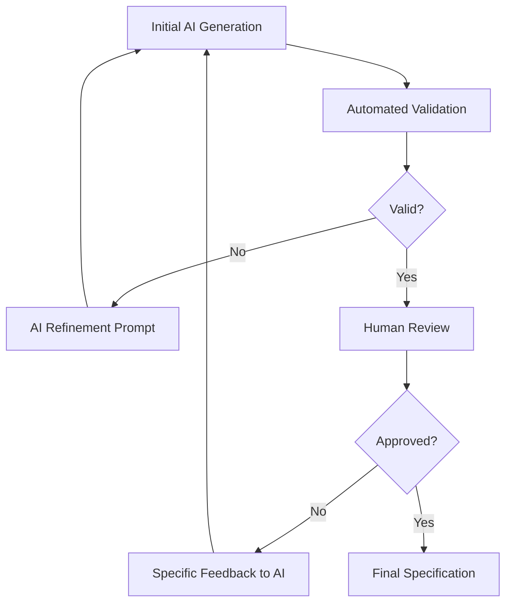

# AI Integration MSL Workflow

**Complete guide for using AI assistants with MSL specifications. Learn effective prompting, validation strategies, context management, and Claude Code agent integration for AI-assisted specification development.**

## Introduction

AI assistants excel at understanding and generating MSL specifications because MSL uses natural language patterns. This guide shows how to leverage AI for faster, higher-quality specification development while maintaining human oversight.

## AI-Assisted Specification Writing

### Effective Prompt Templates

#### Template 1: Initial Specification Creation
```markdown
Create an MSL specification for a user authentication system with these requirements:
- OAuth 2.0 with Google and GitHub
- Session management with 7-day expiry
- Rate limiting on login attempts
- Password reset via email
- Two-factor authentication optional

Use MSL Level 1 with requirement IDs. Include error cases and performance requirements.
```

**AI Response Structure:**
```markdown
---
id: user-authentication
version: 1.0
tags: [auth, security, oauth]
---
# User Authentication System

## Summary
OAuth 2.0 based authentication with session management, rate limiting, and optional 2FA.

## Requirements

### Authentication Methods
- REQ-001: System supports OAuth 2.0 authentication with Google provider
- REQ-002: System supports OAuth 2.0 authentication with GitHub provider
- REQ-003: System provides traditional email/password authentication as fallback
...
```

#### Template 2: Specification Refinement
```markdown
Review and improve this MSL specification:
[paste current specification]

Check for:
1. Testability - all requirements measurable
2. Completeness - error cases included
3. Consistency - no conflicting requirements
4. DRY compliance - no duplications

Output the improved specification with change notes.
```

#### Template 3: Test Case Generation
```markdown
Generate test cases from this MSL specification:
[paste specification]

For each requirement:
1. Create positive test case
2. Create negative test case
3. Include edge cases where applicable

Format as Gherkin scenarios or test descriptions.
```

#### Template 4: Specification Validation
```markdown
Validate this MSL specification for architectural quality:
[paste specification]

Analyze:
- DRY compliance (score 0-100)
- Requirement testability (percentage)
- Cohesion and coupling
- Missing requirements
- Potential conflicts

Provide specific improvement recommendations.
```

#### Template 5: Template Extraction
```markdown
Analyze these specifications and extract common patterns:
[paste multiple specifications]

Create an MSL Level 2 template with:
- Common requirements as base
- Variables for customization
- Clear inheritance structure

Show how each original spec would use the template.
```

### Context Management Strategies

#### Strategy 1: Incremental Context Building
```markdown
# Initial prompt (minimal context)
"Create basic user API specification"

# Follow-up with context
"Now add authentication requirements. Our system uses JWT tokens with 1-hour expiry."

# Build on previous responses
"Add rate limiting: 100 requests per minute per user, 429 response when exceeded"

# Result: Specification built incrementally with focused context
```

#### Strategy 2: Context Windowing
```markdown
# Large specification approach
## Part 1: Core Requirements
"Create MSL spec for user management: focus on CRUD operations"

## Part 2: Security Requirements  
"Add security requirements to the user management spec: focus on authorization and data protection"

## Part 3: Integration Requirements
"Add integration requirements: API contracts, event publishing, and database constraints"

## Final: Consolidation
"Combine all parts into a complete, validated MSL specification"
```

#### Strategy 3: Reference-Based Context
```markdown
# Provide reference structure
"Using this structure as reference:
- Core specifications in specs/core/
- Feature specifications in specs/features/
- Use inheritance from base-api.md

Create a new payment processing specification that fits this architecture."
```

#### Strategy 4: Example-Driven Context
```markdown
# Provide examples
"Here's an example of our API specification style:
[paste example spec]

Create a similar specification for order management following the same patterns, naming conventions, and requirement structure."
```

### Quality Control Procedures

#### Pre-Generation Validation
```markdown
## Checklist Before AI Generation
- [ ] Clear scope defined
- [ ] Existing specifications reviewed
- [ ] Constraints documented
- [ ] Examples prepared
- [ ] Success criteria defined
```

#### Post-Generation Validation
```markdown
## AI Output Validation Process

1. **Structural Check**
   - Has ## Requirements section
   - Valid frontmatter (if Level 1+)
   - Consistent ID format

2. **Content Validation**
   ```bash
   msl-validate ai-generated-spec.md
   ```

3. **Human Review**
   - Domain accuracy
   - Business logic correctness
   - Compliance with standards

4. **Integration Testing**
   - No conflicts with existing specs
   - Valid inheritance relationships
   - Cross-references resolve
```

#### Iterative Refinement Process


## Claude Code Agent Usage

### MSL Validation Agent Integration

#### Example 1: Specification Quality Analysis
```markdown
@claude Please analyze the architectural quality of my user authentication specification and suggest improvements for testability and DRY compliance.

[Attach: specs/auth/user-auth.md]
```

**Expected Response:**
```markdown
I'll analyze your user authentication specification for architectural quality.

## Quality Assessment

**Overall Score: 76/100** (Needs Improvement)

### DRY Compliance (65/100)
- **Issue**: Requirements REQ-003, REQ-007, and REQ-011 contain duplicate session timeout values
- **Fix**: Extract to variable `session_timeout: 7200`

### Testability (72/100)
- **Issue**: REQ-005 "System should handle high load" lacks measurable criteria
- **Fix**: "System handles 1000 concurrent authentication requests with p99 latency <500ms"

### Recommendations
1. Extract common timeout values to variables
2. Add specific metrics to performance requirements
3. Include error rate thresholds
4. Define rollback procedures for failed auth

Would you like me to generate the improved specification?
```

#### Example 2: Batch Validation Workflow
```markdown
@claude Run batch validation on my specifications directory and identify the top 3 patterns that should be extracted into templates.

Directory structure:
specs/
├── api/ (15 files)
├── database/ (8 files)
└── ui/ (12 files)
```

**Expected Response:**
```markdown
I'll analyze your specifications for common patterns and template opportunities.

## Batch Validation Summary
- **Files Analyzed**: 35
- **Average Quality**: 81/100
- **Common Issues**: 42% have DRY violations

## Top 3 Template Opportunities

### 1. REST API Endpoint Template (12 instances)
```yaml
Pattern detected in:
- api/user-api.md
- api/order-api.md
- api/product-api.md

Common structure:
- CRUD operations
- Authentication requirement
- JSON response format
- Error handling patterns
```

### 2. Database Table Template (7 instances)
```yaml
Pattern detected in:
- database/users-table.md
- database/orders-table.md

Common structure:
- ID field (UUID)
- Timestamps (created_at, updated_at)
- Soft delete (deleted_at)
- Audit fields
```

### 3. UI Component Template (8 instances)
```yaml
Pattern detected in:
- ui/form-component.md
- ui/list-component.md

Common structure:
- Visual requirements
- Validation rules
- Accessibility requirements
- Responsive behavior
```

Would you like me to create these templates?
```

#### Example 3: Specification Generation from Code
```markdown
@claude Generate an MSL specification from this TypeScript implementation:

```typescript
export class PaymentService {
  async processPayment(
    amount: number,
    currency: string,
    method: PaymentMethod,
    userId: string
  ): Promise<PaymentResult> {
    // Validate amount
    if (amount <= 0 || amount > 999999) {
      throw new InvalidAmountError();
    }
    
    // Check rate limit
    if (await this.rateLimiter.isLimited(userId)) {
      throw new RateLimitError();
    }
    
    // Process based on method
    const result = await this.processor.charge(amount, currency, method);
    
    // Emit event
    await this.events.publish('payment.processed', {
      userId,
      amount,
      currency,
      transactionId: result.id
    });
    
    return result;
  }
}
```
```

**Expected Response:**
```markdown
I'll generate an MSL specification from your TypeScript implementation.

```markdown
---
id: payment-processing
version: 1.0
tags: [payments, api, financial]
---
# Payment Processing Service

## Summary
Service for processing payments with multiple payment methods, rate limiting, and event publishing.

## Requirements

### Payment Processing
- REQ-001: System processes payments with amount, currency, payment method, and user ID
- REQ-002: Payment amounts must be greater than 0 and less than or equal to 999,999
- REQ-003: System returns payment result containing transaction ID upon successful processing

### Validation
- REQ-004: System validates payment amount is within acceptable range (0 < amount ≤ 999,999)
- REQ-005: System rejects payments with invalid amounts via InvalidAmountError
- REQ-006: System validates currency format according to ISO 4217

### Rate Limiting
- REQ-007: System enforces rate limiting per user ID
- REQ-008: System rejects payments exceeding rate limit via RateLimitError
- REQ-009: Rate limit check occurs before payment processing

### Event Publishing
- REQ-010: System publishes 'payment.processed' event after successful payment
- REQ-011: Event payload includes userId, amount, currency, and transactionId
- REQ-012: Event publishing is asynchronous and non-blocking

### Error Handling
- REQ-013: System throws InvalidAmountError for amounts ≤0 or >999,999
- REQ-014: System throws RateLimitError when user exceeds rate limit
- REQ-015: System propagates processor errors to caller

### Performance
- REQ-016: Payment processing completes within 3 seconds for 95th percentile
- REQ-017: System handles 100 concurrent payment requests
```

This specification captures the behavior from your implementation. Should I add test scenarios?
```

### Prompt Engineering Best Practices

#### Structure Your Prompts

```markdown
## Optimal Prompt Structure

1. **Context**: "We're building an e-commerce platform"
2. **Task**: "Create an MSL specification for shopping cart functionality"
3. **Constraints**: "Must support guest checkout, save for later, and bulk discounts"
4. **Format**: "Use MSL Level 1 with REQ-XXX format"
5. **Examples**: "Similar to our existing order-api.md specification"
6. **Output**: "Include error cases and performance requirements"
```

#### Iterative Refinement Prompts

```markdown
## Round 1: Basic Structure
"Create a shopping cart specification with add, remove, and checkout"

## Round 2: Add Details
"Add quantity limits, stock validation, and price calculation requirements"

## Round 3: Error Cases
"Add error handling for out-of-stock, invalid quantities, and payment failures"

## Round 4: Performance
"Add performance requirements for cart operations and scalability needs"

## Round 5: Polish
"Review for testability and DRY compliance, score should be >85"
```

#### Domain-Specific Prompts

```markdown
## Financial Domain
"Create MSL spec for payment processing following PCI compliance requirements, including tokenization, fraud detection, and settlement procedures"

## Healthcare Domain  
"Create MSL spec for patient records following HIPAA requirements, including access controls, audit logging, and data retention policies"

## IoT Domain
"Create MSL spec for device management including provisioning, OTA updates, telemetry collection, and offline operation"
```

## Validation of AI-Generated Specs

### Automated Validation Pipeline

```javascript
// validate-ai-spec.js
const { validate } = require('msl-tools');
const ai = require('./ai-client');

async function validateAISpec(prompt, maxIterations = 3) {
  let spec = await ai.generate(prompt);
  let iteration = 0;
  
  while (iteration < maxIterations) {
    const validation = await validate(spec);
    
    if (validation.score >= 85) {
      return { spec, validation, iterations: iteration };
    }
    
    // Refine with validation feedback
    const refinementPrompt = `
      Improve this specification to address these issues:
      ${validation.issues.map(i => `- ${i.message}`).join('\n')}
      Current score: ${validation.score}/100
      Target score: 85/100
    `;
    
    spec = await ai.refine(spec, refinementPrompt);
    iteration++;
  }
  
  throw new Error(`Could not achieve target score after ${maxIterations} iterations`);
}
```

### Human Review Checklist

```markdown
## AI Specification Review Checklist

### Accuracy
- [ ] Domain logic is correct
- [ ] Technical requirements are feasible
- [ ] No contradictory requirements
- [ ] Aligns with system architecture

### Completeness
- [ ] All user stories covered
- [ ] Error cases included
- [ ] Performance requirements specified
- [ ] Security considerations addressed

### Quality
- [ ] Requirements are testable
- [ ] No implementation details in requirements
- [ ] Consistent terminology used
- [ ] Appropriate abstraction level

### Integration
- [ ] Compatible with existing specs
- [ ] Inheritance used appropriately
- [ ] Cross-references valid
- [ ] No duplicate functionality
```

### Common AI-Generated Issues

#### Issue 1: Over-Specification
**Problem:** AI includes implementation details
```markdown
# AI Generated (Bad)
- REQ-001: Store password as bcrypt hash with salt rounds 10 in PostgreSQL users table

# Human Refined (Good)
- REQ-001: Store passwords using secure, salted hashing algorithm
```

#### Issue 2: Ambiguous Language
**Problem:** AI uses vague terms
```markdown
# AI Generated (Bad)
- REQ-002: System should respond quickly

# Human Refined (Good)
- REQ-002: API responds within 200ms for 95th percentile of requests
```

#### Issue 3: Missing Context
**Problem:** AI doesn't know domain constraints
```markdown
# AI Generated (Incomplete)
- REQ-003: Process credit card payments

# Human Refined (Complete)
- REQ-003: Process credit card payments via Stripe API with PCI compliance
```

## Workflow Patterns

### Pattern 1: AI-First Specification

**Trigger:** New feature request  
**Duration:** 2-4 hours  
**Human effort:** 30 minutes

```markdown
## Process

1. **AI Generation (5 min)**
   - Provide requirements to AI
   - Generate initial specification

2. **Automated Validation (1 min)**
   - Run msl-validate
   - Check quality score

3. **AI Refinement (5 min)**
   - Feed validation errors back to AI
   - Generate improved version

4. **Human Review (20 min)**
   - Check domain accuracy
   - Verify business logic
   - Add missing context

5. **Final Polish (5 min)**
   - AI generates test cases
   - Human approves
```

**Outcome:** High-quality specification in fraction of time

### Pattern 2: Pair Specification with AI

**Trigger:** Complex specification needed  
**Duration:** 1-2 hours continuous  
**Mode:** Interactive dialogue

```markdown
## Dialogue Example