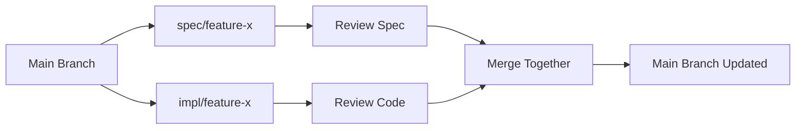
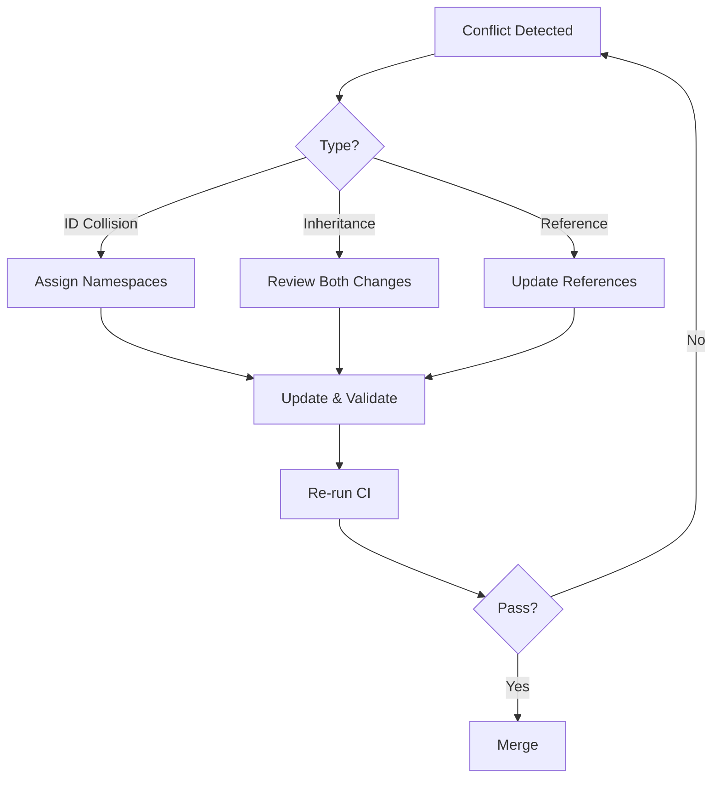

# Team Collaboration MSL Workflow

**Complete guide for teams using MSL to collaborate on specifications. Learn branching strategies, review processes, role definitions, and conflict resolution patterns for effective team specification development.**

## Introduction

Team specification development requires coordination, clear processes, and shared understanding. MSL integrates naturally with existing development workflows while adding structure to requirement management.

## Team Roles and Responsibilities

### Specification Owner
**Responsibility:** Overall specification architecture and quality
```markdown
## Duties
- Define specification structure
- Ensure consistency across specs
- Resolve specification conflicts
- Maintain quality standards (>85 score)
- Review and approve major changes

## Typical Actions
- Weekly specification review
- Template creation and maintenance
- Quality gate enforcement
- Architecture decisions
```

### Feature Lead
**Responsibility:** Feature-specific specifications
```markdown
## Duties
- Write feature specifications
- Coordinate with implementation team
- Update specs during development
- Ensure test coverage

## Typical Actions
- Create feature branch with specs
- Daily spec updates
- Coordinate spec reviews
- Merge feature specs to main
```

### Developer
**Responsibility:** Implementation aligned with specifications
```markdown
## Duties
- Read and understand specifications
- Implement according to specs
- Propose spec updates when needed
- Participate in spec reviews

## Typical Actions
- Reference specs in code comments
- Create PRs linking spec and code
- Flag specification issues
- Suggest improvements
```

### QA Engineer
**Responsibility:** Test coverage and validation
```markdown
## Duties
- Derive test cases from specifications
- Validate implementation against specs
- Report specification gaps
- Ensure requirement testability

## Typical Actions
- Create test matrices from requirements
- Link test results to requirements
- Report untestable requirements
- Validate specification completeness
```

### Technical Writer
**Responsibility:** Documentation from specifications
```markdown
## Duties
- Generate user documentation from specs
- Maintain specification clarity
- Ensure consistent terminology
- Create end-user guides

## Typical Actions
- Review specs for clarity
- Extract user-facing requirements
- Generate API documentation
- Maintain glossary
```

## Branching and Merging Strategies

### Strategy 1: Feature Branch Workflow

```bash
# Developer creates feature branch
git checkout -b feature/user-auth

# Create/update specifications
vim specs/features/user-auth.md
msl-validate specs/features/user-auth.md

# Commit spec first
git add specs/features/user-auth.md
git commit -m "spec: Add user authentication requirements"

# Implement feature
vim src/auth/
git add src/auth/
git commit -m "feat: Implement user authentication per spec"

# Push for review
git push origin feature/user-auth
```

**Merge Rules:**
1. Specification must be approved first
2. Implementation PR references spec PR
3. Both merge together or not at all

### Strategy 2: Specification-First Workflow

```bash
# Step 1: Spec branch
git checkout -b spec/payment-api
vim specs/api/payment.md
git commit -m "spec: Payment API requirements"
git push origin spec/payment-api
# PR #101 created and approved

# Step 2: Implementation branch (after spec approved)
git checkout main
git pull
git checkout -b impl/payment-api
# Implementation referencing approved spec
git commit -m "impl: Payment API per specs/api/payment.md"
git push origin impl/payment-api
# PR #102 created, references PR #101
```

### Strategy 3: Parallel Development



**Process:**
```bash
# Two developers work in parallel
# Developer A: Specifications
git checkout -b spec/search
vim specs/search.md

# Developer B: Implementation (based on draft spec)
git checkout -b impl/search
vim src/search/

# Daily sync meeting
# Update both branches based on learnings

# Final merge when both ready
git checkout main
git merge spec/search
git merge impl/search
```

## Review and Approval Processes

### Specification Review Checklist

```markdown
## PR Review Checklist for Specifications

### Structure
- [ ] Has required `## Requirements` section
- [ ] Includes summary/overview
- [ ] Uses consistent requirement ID format
- [ ] Follows file naming convention

### Quality
- [ ] Validation score ≥85
- [ ] Requirements are testable
- [ ] No DRY violations
- [ ] Examples provided for complex items

### Completeness
- [ ] Covers happy path
- [ ] Includes error cases
- [ ] Defines edge cases
- [ ] Specifies performance requirements

### Integration
- [ ] Compatible with existing specs
- [ ] No conflicts with other features
- [ ] Inheritance used appropriately
- [ ] Cross-references are valid

### Documentation
- [ ] Changelog updated
- [ ] Index/navigation updated
- [ ] Related specs updated if needed
- [ ] Migration notes if breaking changes
```

### Review Workflow

**1. Automated Checks (CI)**
```yaml
# .github/workflows/spec-review.yml
name: Specification Review

on:
  pull_request:
    paths:
      - 'specs/**/*.md'

jobs:
  validate:
    runs-on: ubuntu-latest
    steps:
      - uses: actions/checkout@v3
      
      - name: Validate Specifications
        run: |
          npx msl-validate ./specs/ -r --min-score 85
          
      - name: Check References
        run: |
          npx msl-validate ./specs/ --check-references
          
      - name: Comment Results
        uses: actions/github-script@v6
        with:
          script: |
            const results = require('./validation-results.json');
            const comment = formatResults(results);
            github.rest.issues.createComment({
              issue_number: context.issue.number,
              body: comment
            });
```

**2. Peer Review (Human)**
```markdown
## Review Comments Template

### Clarity
"REQ-001 is ambiguous. Suggest: 'API returns 200 status for valid requests'"

### Testability
"REQ-002 lacks measurable criteria. Add specific timeout value."

### Completeness
"Missing error case: What happens when database is unavailable?"

### Consistency
"This conflicts with auth-spec.md REQ-010. Please reconcile."
```

**3. Approval Gates**
```yaml
# CODEOWNERS for specifications
/specs/core/            @spec-owners
/specs/features/        @feature-leads
/specs/infrastructure/  @platform-team

# Branch protection rules
- Require 2 approvals for /specs/core/
- Require 1 approval for /specs/features/
- Require validation score ≥85
- Require CI passing
```

## Conflict Resolution

### Specification Conflicts

**Conflict Type 1: Requirement ID Collision**
```bash
# Both developers used REQ-001
# Developer A's branch
specs/feature-a.md: REQ-001: User login

# Developer B's branch  
specs/feature-b.md: REQ-001: Data export

# Resolution: Namespace requirements
specs/feature-a.md: AUTH-001: User login
specs/feature-b.md: EXPORT-001: Data export
```

**Conflict Type 2: Inheritance Override**
```markdown
# Parent specification changed
# base-api.md (main branch)
- REQ-001: Returns JSON

# feature-api.md (feature branch)
- REQ-001: [OVERRIDE] Returns XML  # Now conflicts!

# Resolution: Review if override still needed
# Option 1: Update child to match new parent
# Option 2: Create new requirement ID
# Option 3: Question parent change
```

**Conflict Type 3: Cross-Reference Breaks**
```markdown
# Specification A references B
# specs/auth.md
See database.md REQ-010 for user schema

# Specification B changed REQ-010 to REQ-020
# Resolution: Update all references
grep -r "database.md REQ-010" specs/ | update-references
```

### Resolution Process



## CI/CD Integration

### Complete Pipeline

```yaml
# .gitlab-ci.yml
stages:
  - validate
  - test
  - build
  - deploy

# Stage 1: Validate Specifications
validate:specs:
  stage: validate
  script:
    - npm install -g msl-tools
    - msl-validate ./specs/ -r --min-score 85
    - msl-validate ./specs/ --check-inheritance
    - msl-validate ./specs/ --check-references
  artifacts:
    reports:
      junit: validation-report.xml
    paths:
      - validation-report.html
    when: always

# Stage 2: Generate Tests from Specs
generate:tests:
  stage: test
  script:
    - npm run generate-tests-from-specs
    - npm test
  dependencies:
    - validate:specs

# Stage 3: Build with Spec Verification
build:app:
  stage: build
  script:
    - npm run build
    - npm run verify-against-specs
  artifacts:
    paths:
      - dist/
      - spec-coverage.html

# Stage 4: Deploy with Documentation
deploy:docs:
  stage: deploy
  script:
    - msl-render ./specs/ -f site -o public/
    - deploy-docs public/
  only:
    - main
```

### Specification Coverage

```javascript
// spec-coverage.js
const specs = require('./specs/index.json');
const tests = require('./test-manifest.json');

function calculateCoverage() {
  const requirements = extractRequirements(specs);
  const testedReqs = extractTestedRequirements(tests);
  
  const coverage = {
    total: requirements.length,
    tested: testedReqs.length,
    percentage: (testedReqs.length / requirements.length) * 100,
    missing: requirements.filter(r => !testedReqs.includes(r))
  };
  
  if (coverage.percentage < 80) {
    console.error(`Spec coverage ${coverage.percentage}% below 80%`);
    console.log('Missing tests for:', coverage.missing);
    process.exit(1);
  }
  
  return coverage;
}
```

## Team Communication Patterns

### Daily Standup Integration

```markdown
## Standup Template with Specs

### Yesterday
- Implemented REQ-001 through REQ-003
- Updated payment-api.md with error cases

### Today
- Working on REQ-004 (authentication)
- Will update auth-spec.md with new requirements

### Blockers
- REQ-005 conflicts with security-spec.md
- Need review on PR #123 (spec updates)
```

### Specification Review Meetings

**Weekly Spec Review Agenda:**
```markdown
## Weekly Specification Review

### 1. New Specifications (10 min)
- Review newly created specs
- Assign owners
- Set quality targets

### 2. Changed Specifications (15 min)
- Review major changes
- Assess impact
- Update dependent specs

### 3. Quality Metrics (5 min)
- Overall validation score
- Trending issues
- Action items

### 4. Upcoming Work (10 min)
- Planned specifications
- Resource allocation
- Timeline review

### 5. Retrospective (5 min)
- What worked well
- What needs improvement
- Process adjustments
```

### Async Communication

**Specification Comments in Code:**
```typescript
/**
 * Implementation of user authentication
 * @spec specs/auth/user-auth.md
 * @requirements REQ-001, REQ-002, REQ-003
 */
class UserAuthService {
  /**
   * Authenticate user with credentials
   * @implements specs/auth/user-auth.md#REQ-001
   */
  async authenticate(email: string, password: string) {
    // Implementation
  }
}
```

**Slack/Discord Integration:**
```javascript
// spec-bot.js
client.on('message', async (msg) => {
  if (msg.content.startsWith('!spec')) {
    const specName = msg.content.split(' ')[1];
    const validation = await validateSpec(specName);
    
    msg.reply(`
      Spec: ${specName}
      Status: ${validation.valid ? '✅' : '❌'}
      Score: ${validation.score}/100
      Issues: ${validation.issues.length}
    `);
  }
});
```

## Common Team Patterns

### Pattern 1: Specification Sprint

**Trigger:** New project or major feature  
**Duration:** 1-2 days  
**Participants:** Entire team

**Process:**
```markdown
## Day 1: Specification Creation
Morning:
- Kickoff meeting (1 hour)
- Break into sub-teams
- Draft specifications

Afternoon:
- Cross-team review
- Identify conflicts
- Initial validation

## Day 2: Refinement
Morning:
- Address review comments
- Resolve conflicts
- Update cross-references

Afternoon:
- Final validation
- Approval process
- Commit to main branch
```

**Outcome:** Complete specification set ready for implementation

### Pattern 2: Rotating Spec Owner

**Trigger:** Distribute specification knowledge  
**Rotation:** Weekly or bi-weekly

**Responsibilities:**
```markdown
## Spec Owner of the Week
- Review all specification PRs
- Run weekly validation report
- Update specification index
- Lead spec review meeting
- Archive obsolete specs
- Extract common patterns
```

**Benefits:**
- Shared ownership
- Knowledge distribution
- Fresh perspectives
- Reduced bottlenecks

### Pattern 3: Specification Mob Sessions

**Trigger:** Complex or critical specifications  
**Duration:** 2-4 hours  
**Participants:** 3-5 team members

**Setup:**
```bash
# Mob programming for specifications
# Driver: Types the specification
# Navigators: Direct what to write
# Rotate every 15 minutes

# Tools
- Shared screen (driver)
- Timer for rotations
- Live validation running
- Reference documents open
```

**Example Session:**
```markdown
## Payment API Specification Mob Session

Participants: Alice (PO), Bob (Dev), Carol (QA), Dave (Architect)

10:00 - Setup, review existing specs
10:15 - Alice drives: Requirements overview
10:30 - Bob drives: Technical requirements
10:45 - Carol drives: Error cases and validation
11:00 - Dave drives: Performance requirements
11:15 - Alice drives: Review and refine
11:30 - Final validation and commit
```

## Migration Path for Existing Teams

### Week 1: Introduction and Setup

**Day 1-2: Team Training**
```markdown
## Training Agenda
1. MSL Overview (1 hour)
2. Hands-on Tutorial (2 hours)
3. Tool Setup (1 hour)
4. Practice Specification (1 hour)
```

**Day 3-4: Environment Setup**
```bash
# Repository setup
mkdir specs/
git add specs/
npm install --save-dev msl-tools

# CI/CD pipeline
cp templates/msl-ci.yml .github/workflows/

# Git hooks
cp templates/pre-commit .git/hooks/
```

**Day 5: First Team Specification**
- Choose simple, well-understood feature
- Write specification together
- Validate and review as team
- Commit to main branch

### Week 2: Establishing Rhythm

```markdown
## Daily Practices
- Morning: Check specification validation dashboard
- During development: Update specs with code
- Evening: Commit specs and code together

## Weekly Practices
- Monday: Specification planning
- Wednesday: Mid-week spec review
- Friday: Quality metrics review
```

### Week 3: Scaling Up

```markdown
## Expand Coverage
- Convert existing documentation to MSL
- Add specifications for current features
- Create templates for common patterns
- Set up automated reporting

## Team Practices
- Assign specification owners
- Establish review process
- Define quality gates
- Create team guidelines
```

### Week 4: Optimization

```markdown
## Measure and Improve
- Review metrics from first 3 weeks
- Identify bottlenecks
- Adjust processes
- Plan next month's goals

## Success Criteria
- [ ] All new features have specs
- [ ] Average quality score >85
- [ ] <2 day spec-to-implementation time
- [ ] >90% team adoption
```

## Obstacles and Solutions

### Obstacle 1: "Specification reviews slow us down"

**Solution:** Parallel review process
```yaml
# Enable parallel spec and code development
process:
  - Draft spec created (30 min)
  - Implementation starts with draft
  - Spec refined during implementation
  - Final review of spec + code together
```

### Obstacle 2: "Too many merge conflicts in specs"

**Solution:** Requirement namespacing
```markdown
# Assign requirement ranges by team
Team A: REQ-001 to REQ-299
Team B: REQ-300 to REQ-599
Team C: REQ-600 to REQ-899
Shared: REQ-900 to REQ-999
```

### Obstacle 3: "Inconsistent specification quality"

**Solution:** Templates and automation
```bash
# Automated quality enforcement
msl-validate --min-score 85 --fix
msl-lint --fix
pre-commit run --all-files
```

### Obstacle 4: "Developers don't read specs"

**Solution:** Integration with development workflow
```javascript
// Link specs to code
/** @spec specs/feature.md#REQ-001 */
function implementFeature() {
  // IDE shows spec on hover
}

// Generate TODO lists from specs
npm run specs-to-todos
```

### Obstacle 5: "Specs become outdated"

**Solution:** Specification-code proximity
```
src/
├── auth/
│   ├── auth.service.ts
│   └── auth.spec.md    # Spec lives with code
├── payment/
│   ├── payment.service.ts
│   └── payment.spec.md
```

## Success Metrics

### Team KPIs

| Metric | Target | Measurement |
|--------|---------|-----------|
| Specification Coverage | >90% | Features with specs / Total features |
| Average Quality Score | >85 | Mean validation score |
| Review Turnaround | <4 hours | Time from PR to approval |
| Implementation Accuracy | >95% | Features matching spec / Total implemented |
| Team Adoption | 100% | Team members using MSL / Total team |

### Weekly Team Dashboard

```markdown
# Team MSL Dashboard - Week 45

## Specifications
- Created: 12
- Updated: 34
- Archived: 3

## Quality
- Average Score: 87/100 ✅
- Failing Specs: 2 ❌
- Warnings: 18 ⚠️

## Coverage
- Features with Specs: 94% ✅
- Tests Linked to Specs: 78% ⚠️
- Docs Generated: 100% ✅

## Team Participation
- Alice: 15 spec updates
- Bob: 8 spec updates
- Carol: 12 spec updates
- Dave: 9 spec updates

## Action Items
1. Fix failing specs in payment module
2. Improve test coverage for auth specs
3. Schedule spec review for new feature
```

## Anti-Patterns to Avoid

### Anti-Pattern 1: Specification Silos
**Problem:** Each team member writes specs in isolation
**Solution:** Regular spec reviews and mob sessions

### Anti-Pattern 2: Big Bang Specification
**Problem:** Try to specify everything upfront
**Solution:** Iterative specification development

### Anti-Pattern 3: Specification by Committee
**Problem:** Every decision requires full team consensus
**Solution:** Clear ownership and escalation paths

### Anti-Pattern 4: Ignore Validation Warnings
**Problem:** Quality degrades over time
**Solution:** Enforce quality gates in CI/CD

### Anti-Pattern 5: Specification Archaeology
**Problem:** Reverse-engineering specs from old code
**Solution:** Write specs for new features, gradually backfill

## Next Steps

Ready for AI assistance? Check out the [AI Integration Workflow](ai.md).

For individual work patterns, see the [Solo Workflow Guide](solo.md).

---

**Remember:** Successful team specification development requires clear processes, shared ownership, and continuous communication. Start small, iterate frequently, and celebrate specification victories together.